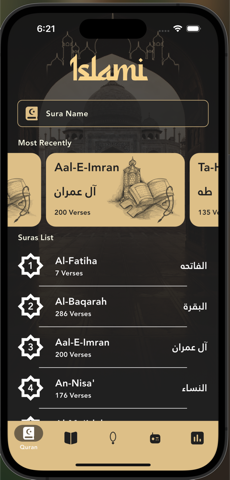
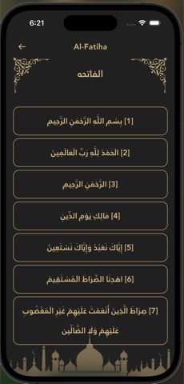
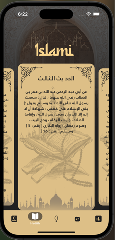
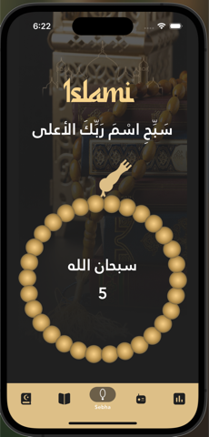
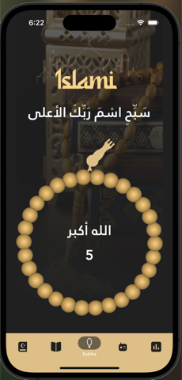
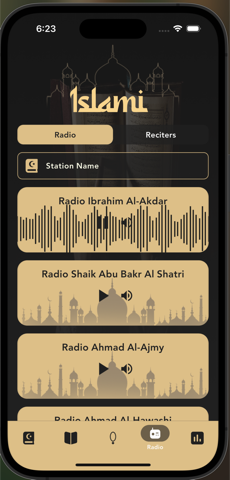
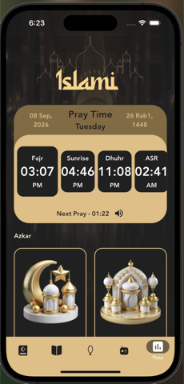
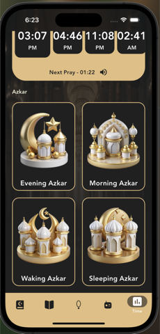
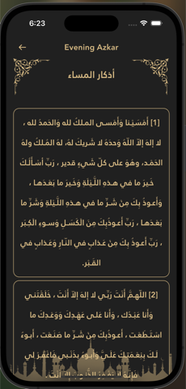

<div align="center">


# Islami

**An Islamic companion app — read the Qur'an, follow the hadith, count your tasbeeh, listen to Qur'an radio, and keep your prayer times.**


</div>

---

## Features

<table>
<tr>
<td width="33%" align="center">
<br>
<b>Qur'an</b><br>
All 114 suras, searchable in Arabic or English.
</td>
<td width="33%" align="center">
<br>
<b>Sura reader</b><br>
Every verse in its own numbered card.
</td>
<td width="33%" align="center">
<br>
<b>Hadeth</b><br>
Fifty hadith as a swipeable deck.
</td>
</tr>
<tr>
<td align="center">
<br>
<b>Sebha</b><br>
Tap to count — the ring turns one bead at a time.
</td>
<td align="center">
<br>
<b>Tasbeeh cycle</b><br>
Every 33, the next phrase takes over.
</td>
<td align="center">
<br>
<b>Radio</b><br>
177 Qur'an stations, searchable and streaming.
</td>
</tr>
<tr>
<td align="center">
<br>
<b>Prayer times</b><br>
The day's five prayers, with a live countdown.
</td>
<td align="center">
<br>
<b>Azkar</b><br>
Morning, evening, waking and sleeping.
</td>
<td align="center">
<br>
<b>Azkar reader</b><br>
Each remembrance numbered and easy to follow.
</td>
</tr>
</table>

## Tech stack

| Concern | Choice |
| --- | --- |
| Framework | Flutter 3.44 · Dart 3.12 |
| Responsive layout | `flutter_screenutil` — one 430 × 932 artboard, scaled per device |
| Vector assets | `flutter_svg` |
| Audio streaming | `just_audio` |
| Prayer times | `adhan` (offline calculation) · `geolocator` · `hijri` |
| Local persistence | `shared_preferences` |
| Networking & formatting | `http` · `intl` |

## Architecture

```
lib/
├── core/                  shared across every feature
│   ├── data/                repositories and stores
│   ├── models/              Sura · Hadith · Zikr · RadioStation
│   ├── theme/               colours and type scale
│   ├── utils/               Arabic text folding for search
│   ├── widgets/             IslamiHeader · DetailScaffold · AppSearchField
│   └── app_strings.dart · app_assets.dart · app_routes.dart
└── modules/               one folder per feature
    ├── splash/  intro/  home/  quran/
    └── hadeth/  sebha/  radio/  times/
            └── screens/ · widgets/ · models/
```

- **Feature-first modules.** Each owns its `screens/` and `widgets/`, plus a `models/` folder
  where it has its own view model (for example `times/models/prayer_schedule.dart`).
- **No cross-module imports.** Nothing in `modules/` reaches into another module's internals;
  anything shared moves up into `core/`.
- **No literals in widgets.** Every user-facing string, asset path and route name lives in
  `core/app_strings.dart`, `core/app_assets.dart` and `core/app_routes.dart`.
- **Repositories own I/O.** Everything under `core/data/` handles the bundle and network reads,
  which keeps the screens declarative.

The Qur'an, hadith and azkar text ships inside the app, so those features work with no
connection — only the radio needs the network.

## Getting started

```bash
git clone https://github.com/seifeldin2003/Islami.git
cd Islami
flutter pub get
flutter run
```

### Release build

```bash
flutter build apk --release --split-per-abi
```

Outputs land in `build/app/outputs/flutter-apk/`. `app-arm64-v8a-release.apk` (~26 MB) is the
one for modern Android phones.
